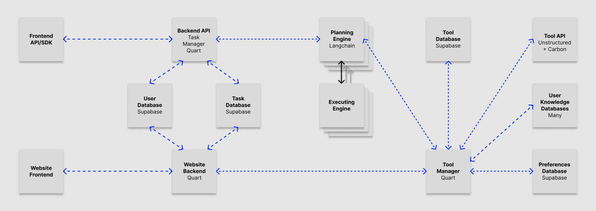

# Pythonic Assistant

## Overview
The intention of Pythonic Assistant is to easily injest, store and complete given tasks. That said, this code base is still underdevelopment and most of that functionality does not work. As of right now, the only completely functional component of this library is the `PythonicAssistant` class within the `pythonic_assistant.py` file.

## Getting Started
This library uses [poetry](https://python-poetry.org/) to maintain the required packages and [dotenv](https://pypi.org/project/python-dotenv/) to maintain the global variables (such as the `OPENAI_API_KEY`).

To get started, clone the repository to a local directory. Then, `cd` into the first `pythonic_assistant` directory and create the file `.env`. Once created, open it and add the following code:

```
OPENAI_API_KEY="[YOUR API KEY HERE]"
```

To generate your `OPENAI_API_KEY`, follow the instructions on the [OpenAI Website](https://platform.openai.com/docs/quickstart?context=python).

Next, you will need to initiate the poetry environment inside the directory.

```
poetry init
```

As a final setup step, start the poetry shell with the following command:

```
poetry shell
```

Now that you have setup the environment, simply type the following to run the pythonic assistant as configured in the `main.py` file.

```
python main.py
```

## Using the PythonicAssistant class
The `PythonicAssistant` class is a wrapper over the [OpenAI Assistants API](https://platform.openai.com/docs/assistants/overview) that provides a very lightweight framework for using Assistants (i.e. Agents). For more information on how to use it, a working example can be found in the `main.py` file. 


## Future Development
Much of the needed functionality to realize the vision for the Pythonic Assistant still needs to be built. The overall goal is to have an Agent that automatically works through the tasks that you give it in natural language.

### Goal Architecture



### Completed

1. **User Database:** Handled by [Supabase Auth](https://supabase.com/docs/guides/auth) functionality.

2. **Task Database:** Added to Supabase.

3. **CRM Database:** Not shown in the  graphic, this datastore in Supabase holds relationships that the user holds with other people. In addition, it has a relational format to save organizations in relation to people and organization in relation to organizations.

4. **Pythonic Assistant:** The `PythonicAssistant` class (described above) wraps the OpenAI Assistants API at the moment. In the future, it will support other frameworks.

### To Be Completed (in Order)

1. **Website Frontend / Backend:** A lightweight Streamlit interface to injest Tasks into the task database, hosted by supabase. This is currently being built in the `interface.py` file, but the PythonicAssistant is currently run inside the browser. The next step is to use [Quart](https://pgjones.gitlab.io/quart/) to create a server that runs the Assistant seperately. The messaging connection to the frontend ([Streamlit](https://docs.streamlit.io/knowledge-base/tutorials/build-conversational-apps)) will be handled through [Supabase Presence](https://supabase.com/docs/guides/realtime/presence) (not Quart as shown above).

2. **Tool Manager / Database:** Create a server using [Quart](https://pgjones.gitlab.io/quart/) that manages Tools.

3. **(Optional) Planning / Executing Engine:** For now, the `PythonicAssistant` class only wraps around the OpenAI Assistants API because of it's ease of use. However, this class was written specifically so that it could handle multiple Agent frameworks in the future. This class should be extended to include [LangChain Agents](https://python.langchain.com/docs/modules/agents/quick_start) (and other Agentic frameworks as they are published). Additionally, the Planning Engine should make use of the Tool Manager created in Step 2 to dynamically allocate tools to the Agent based on the query.

4. **Planning / Executing Server:** Using [Quart](https://pgjones.gitlab.io/quart/), build a server that can be spawned by another instance (see Step 5). This should be a thin wrapper around the Planning / Executing Engine built in Step 3.

5. **Backend API:** Create a server using [Quart](https://pgjones.gitlab.io/quart/) that queries the Supabase instance for new tasks. If the tasks are able to completed by an Agent (like sending an email), then the server automatically spawns a new process to handle that task.

6. **User Knowledge Database:** Using Supabase, add tables that support user information like email account logins, credit card data and other items. If at all possible, ensure SOC2, HIPAA and GDPR compliance as early as possible. By default, Supabase is both [SOC2 and HIPAA compliant](https://supabase.com/blog/supabase-soc2-hipaa).

7. **Prefences Database:** Using Supabase, create a schema that can handle arbitrary preferences for arbitrary things. This will be very, very difficult because a preference could be `"seat me in the window seats on flights longer than 3 hours but aisle on anything shorter"` or it could be `"I prefer tortellini than rigatoni at italian restaurants"`. Both of these are valid preferences, and perhaps storing them in natural language inside a vector store is the easiest way to accomplish this.

8. **Website Frontend / Backend:** Add functionality to support manually editing and updating tasks, querying preferences and user data. Add the functionality to create accounts.

9. **Add Tools:** Add as many tools as possible to the Tool Database.

### On Hold

1. The Twilio API for sending text messages and adding phone calls for the Assistant. The reason this is on hold is because you need a business license to do the [A2P 10DLC](https://www.twilio.com/docs/messaging/compliance/a2p-10dlc) compliance, and I honestly don't care enough to put an entity together for just that right now. Streamlit messenger will do. 